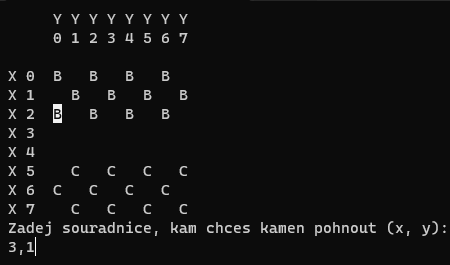

# Česká dáma v C# (konzolová aplikace)

Podle pravidel ze stránky http://www.deskovehry.info/pravidla/ceska-dama.htm 

Kromě vícenásobných skoků a kontroly, jestli nemůže hráč provést svými kameny žádný tah.

Ve zdrojovém kódu je oddělené zobrazení a logika.

# Ukázka


# Spuštění
Ve složce projektu
```
dotnet run
```

